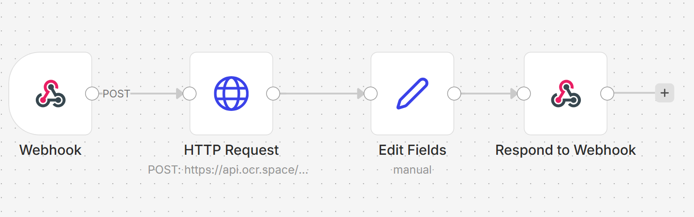
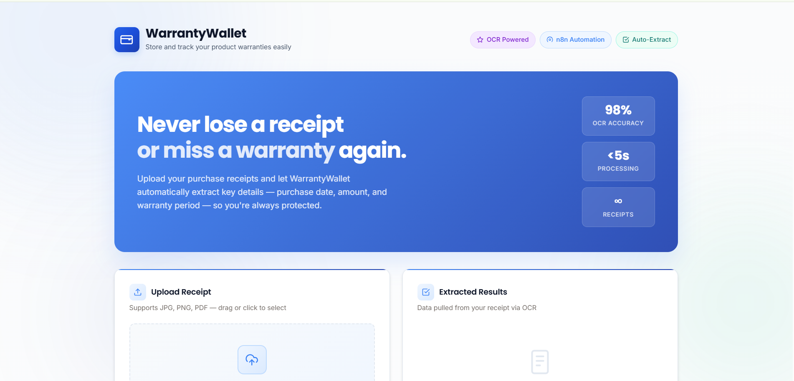
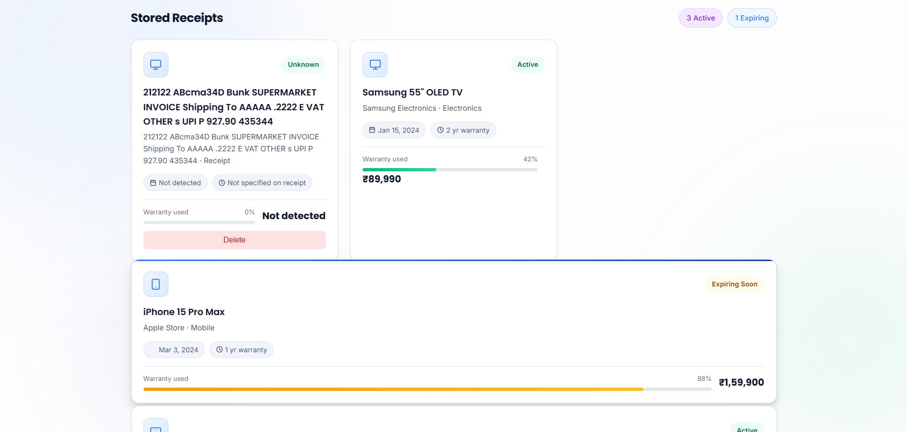
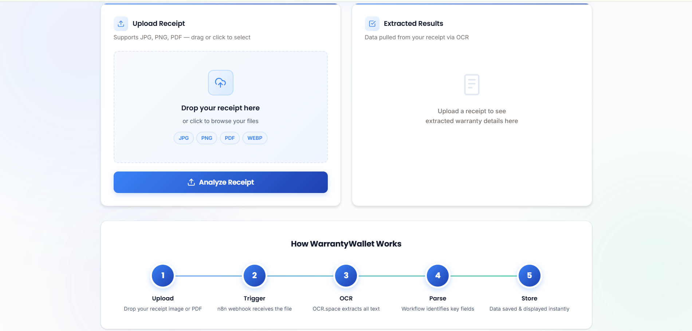
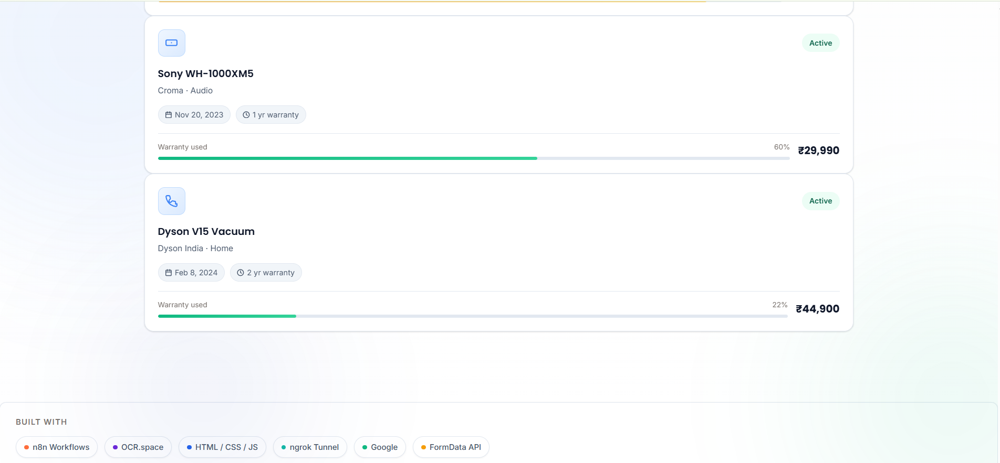

# 🧾 WarrantyWallet — Agentic AI Receipt & Warranty Manager
## 🚀 Live Demo  
https://vyshnavi-0512.github.io/WarrantyWallet/

## 🚀 Overview
WarrantyWallet is an **Agentic AI system** that automates the process of managing receipts and warranties.

It combines:
- 🌐 Web Interface  
- 🔄 n8n Workflow Automation  
- 🤖 AI Models  

### 🎯 What It Does
- Extract structured data from receipts  
- Track warranty timelines  
- Proactively notify users before expiry  

---

## 🎯 Problem Statement

Users struggle with:
- Lost or damaged receipts  
- Forgetting warranty expiry dates  
- Manual tracking of purchases  

**Result → Missed claims & wasted money**

---

## 💡 Proposed Solution

WarrantyWallet solves this by:
- 📸 Receipt digitization  
- 🤖 AI-powered data extraction  
- 📅 Warranty tracking  
- 🔔 Smart reminders  

---

## 🧠 Key Features

- 📸 Upload receipt (Image/PDF)  
- 🤖 AI extracts:
  - Product name  
  - Purchase date  
  - Warranty period  
- ⏰ Warranty expiry tracking  
- 🔔 Reminder notifications  
- 📊 Dashboard (upcoming expiries)  
- 💾 Local storage / database support

  ## Screenshots
  
  
  
  

---
##  Demo Recording
https://drive.google.com/file/d/1wjsU1Phyg_Jgfje_YTD8IuGlyRMcoYIi/view?usp=drivesdk

## 🏗️ Architecture

### 🔹 Frontend
- HTML, CSS, JavaScript  
- Upload receipts  
- View stored data  

### 🔹 Backend / Workflow
- n8n workflow automation  
- AI processing using LLM  
- Data extraction & formatting  

### 🔹 Storage
- LocalStorage (current)  
- Database (future scope)  

---

## ⚙️ Workflow (n8n)

1. User uploads receipt  
2. Webhook triggers n8n workflow  
3. AI processes receipt  
4. Extracted data is structured  
5. Data is stored  
6. Reminder is scheduled  

---

## 🛠️ Tech Stack

- **Frontend:** HTML, CSS, JavaScript  
- **Backend:** n8n  
- **AI:** OpenAI / Claude  
- **Tools:** Ngrok  

## Run Locally
- git clone https://github.com/your-username/WarrantyWallet.git
- cd WarrantyWallet
- Open index.html in your browser (or use VS Code)
- Start n8n:
- npx n8n start
- (Optional) Expose webhook using ngrok:
- ngrok http 5678
- ✅ Done!
- Upload a receipt and the system will process it automatically.

## 👩‍💻 Author
**Vyshnavi Madishetti**
